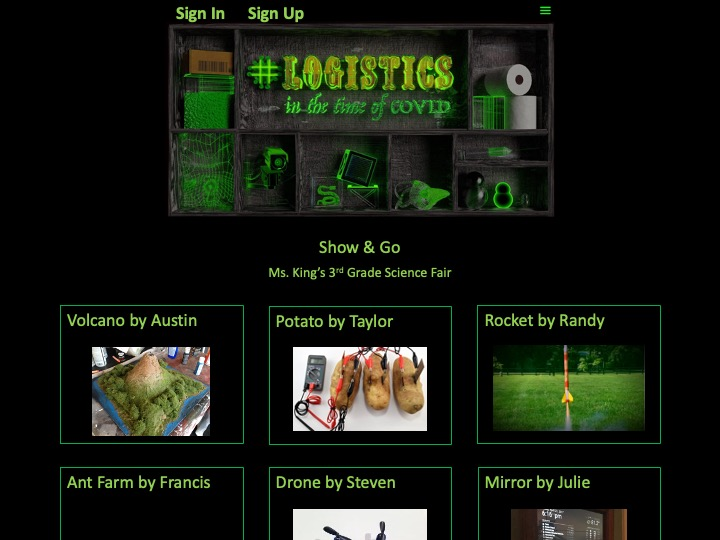
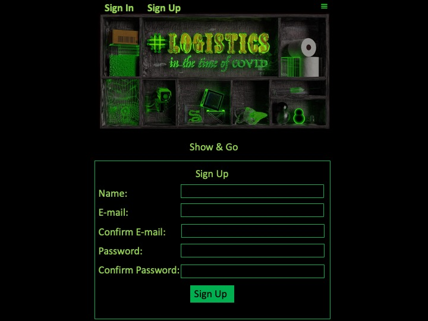
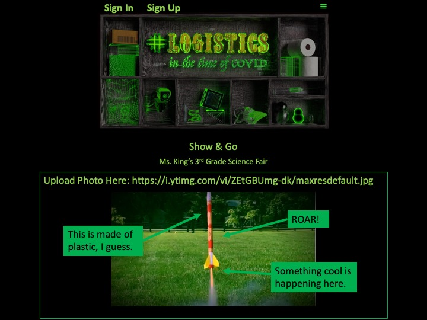
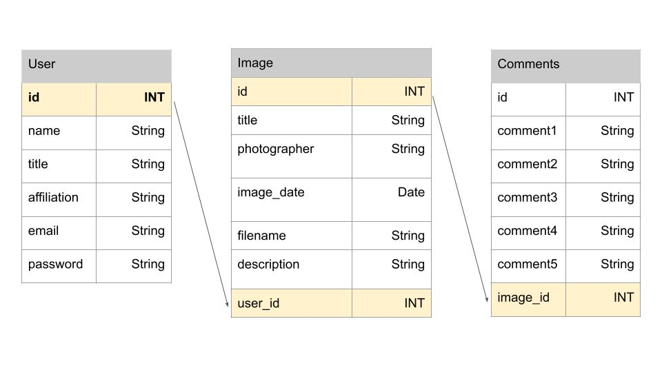

# Project 2: Curiosity Cabinet

**Version 1.0**
## Description:

An Interactive show-and-tell application that allows contributors to upload an image and then annotate that image with notes pinned to specific parts of the image being described. Viewers can then explore the collection of uploaded images and read all the annotations attached to each image.

## User Story:

As a user I want to share my object of curiosity or collection of data with others through a user-friendly platform. \
After logging in as a contributor, I want to easily upload and display an image of my artifact / data collection. \
I want to easily add notes to specific parts of the image by appending nodes with pop-up comment boxes so I can convey my knowledge or curiosities about specific features of my artifact. \
I want to be able to edit and update the notes I attached to each item. \
I want all my artifacts and related annotations to be displayed as an interactive collection that viewers can access by clicking on each artifact and on each related node to display pop-up boxes of my comments.

## Original Wireframe and Tables Diagram:

Gallery View: \

Sign Up Page: \

Annotation Page: \

Tables Diagram: \

## Built Utilizing:

Javascript, Node.js, CSS, Handlebars, Multer, MySql, Sequelize, Github, Heroku

## Screenshot:

[Link to Screencastify of deployed application](https://watch.screencastify.com/v/tRx9XzGKd2ZjF4Bm6T40)

## Deployed Application:

Not quite ready for primetime.

## Future Development:

Add more error handling \
Add routes to display different collections/curiosity cabinets \
Add capacity to link url with image/video and to upload video as artifact \
Add capacity to upload audio notes in addition to text \
Add more categories and parameters for user validation beyond authorized contributors and general viewers, such as validation for viewers adding feedback in a separate comments box \
Add search function by cabinet/collection and by image/artifacts \
Add capacity for user to embed html for collection and/or image for display in other platforms \
Allow user to customize wallpaper and shelves for displaying artifacts \

## Contributors:

Francis Bond - <https://github.com/francis-bond> \
Julie Chu - <https://github.com/jehulie> \
Randy King Jr. - <https://github.com/rkingjr> \
Steven Schmidt - <https://github.com/StevenSchmidtAusTex> \
Austin Stoppenhagen - <https://github.com/DEAD-STOP> \
